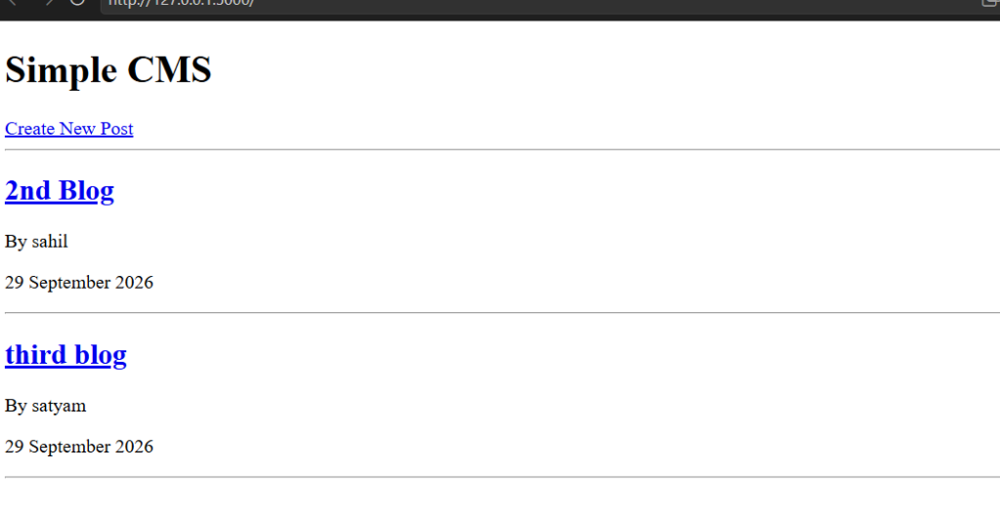
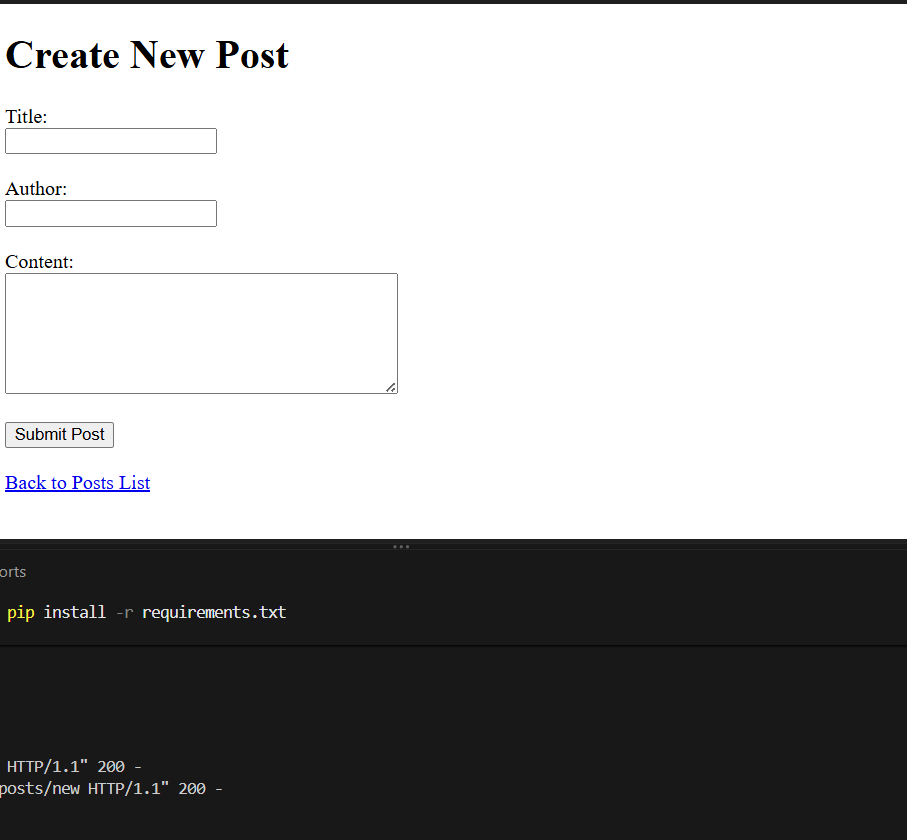
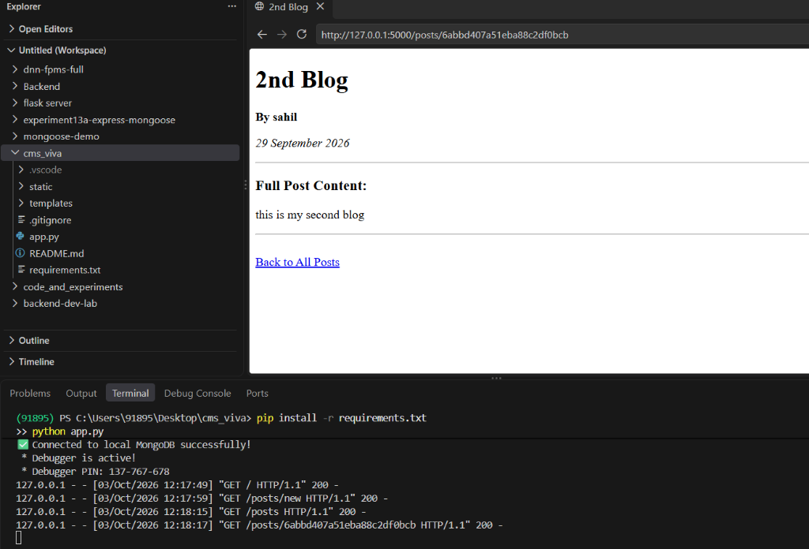
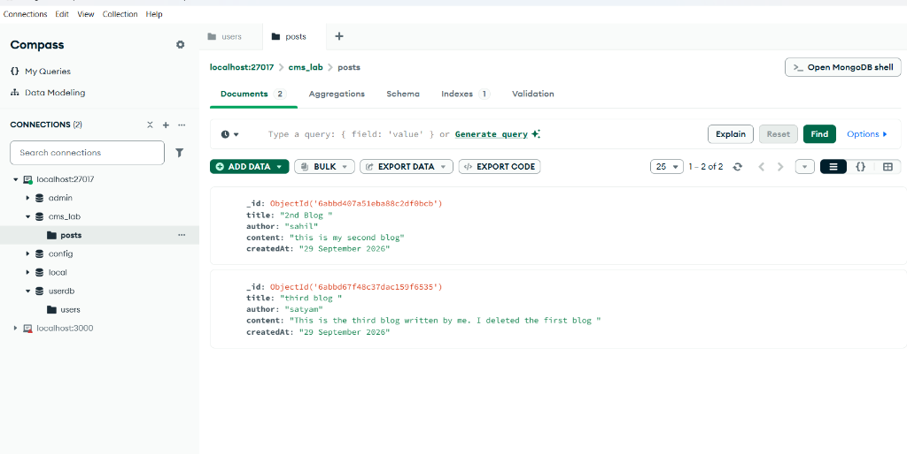

 Blog Content Management System (CMS Lab)

A server-side rendered Blog Content Management System built with **Python, Flask, PyMongo, and Jinja2 Templates** connected to a local **MongoDB** database instance.

---

Output & Application Previews

### 1. All Posts List (`GET /` & `GET /posts`)
Displays all blog posts showing Title (clickable hyperlink), Author name, and creation date. The full content body is excluded from the query for optimized list performance.


---

### 2. Create New Post (`GET /posts/new` & `POST /posts`)
Form to create a new post with Title, Author, and Content fields. Handles POST request validation, generates current date timestamps on the server, and saves into MongoDB.


---

### 3.  Individual Post Details (`GET /posts/<id>`) & VS Code Terminal
Retrieves the full post document from MongoDB by its `ObjectId` and renders the complete content. Also displays the Flask server running in the VS Code terminal with active request logs.


---

### 4. MongoDB Compass Database View (`cms_lab.posts`)
Live MongoDB Compass view demonstrating data persistence in the `cms_lab` database under the `posts` collection.


---

## Directory Structure

```text
cms/
├── app.py                # Flask application with PyMongo routes
├── requirements.txt      # Python dependencies (Flask, pymongo)
├── screenshots/          # Output screenshot images
│   ├── 01_cms_home_posts_list.png
│   ├── 02_cms_create_new_post.png
│   ├── 03_cms_post_detail_vscode.png
│   └── 04_cms_mongodb_compass.png
├── static/
│   └── style.css         # CSS styles
├── templates/
│   ├── posts.html        # List of all posts template
│   ├── new-post.html     # Create new post form template
│   └── post.html         # Single post detail view template
└── README.md             # CMS documentation and output showcase
```

---

## API Endpoints & Routes

| Method | Route | Description | Template Rendered |
| :--- | :--- | :--- | :--- |
| **GET** | `/` or `/posts` | Lists all blog posts (projection: `title`, `author`, `createdAt`) | `templates/posts.html` |
| **GET** | `/posts/new` | Displays form to compose a new post | `templates/new-post.html` |
| **POST** | `/posts` | Submits new post, inserts into MongoDB `cms_lab.posts`, redirects to `/posts` | Redirects to `/posts` |
| **GET** | `/posts/<id>` | Queries post by `ObjectId(id)` and displays full content | `templates/post.html` |

---

##  MongoDB Schema (Collection: `posts`)

```json
{
  "_id": ObjectId("6abbd407a51eba88c2df0bcb"),
  "title": "2nd Blog",
  "author": "sahil",
  "content": "this is my second blog",
  "createdAt": "29 September 2026"
}
```

---


### 3. Open in Browser
- **Home / Post List:** [http://127.0.0.1:5000/posts](http://127.0.0.1:5000/posts)
- **Create Post Form:** [http://127.0.0.1:5000/posts/new](http://127.0.0.1:5000/posts/new)

---

## Features Checklist

-  **MongoDB Connectivity:** Uses `pymongo.MongoClient` with fallback support.
-  **Server-Side Rendering (SSR):** Jinja2 template inheritance.
-  **BSON ObjectId Querying:** Queries individual documents safely using `bson.objectid.ObjectId`.
-  **Date Formatting:** Automatically attaches formatted timestamps (`%d %B %Y`) to posts.
